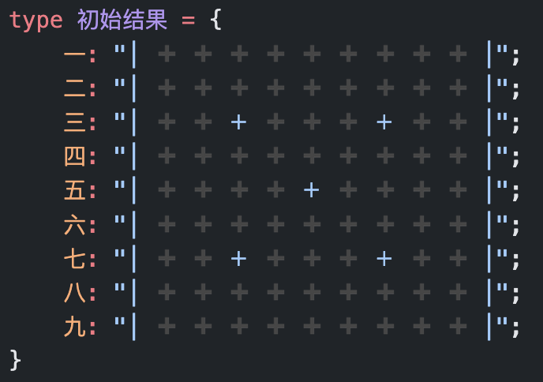
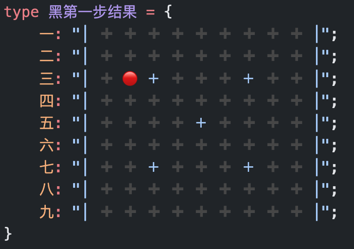
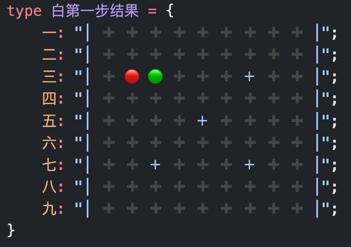

# TS-FIR

> 使用 TS 类型系统实现的五子棋

## 在线体验

<a href="https://www.typescriptlang.org/play?#code/PQKhCgAIUwv9UAQ9DePoaPUomOApgDwA4HsAnAF0mIE9dNJBYOUHvlQX4DIBeSAO0wDdNCBuLPEVIUqkQF5eLSAFc2AE0wAzAJYdZ-HARJlK1QPRmk4oSmZ1grSOqAyFUkKAhgBsAzifDhQEaJEAupoAdTQB9ugM6KgCFugFnagJJyaBgaQtqigG9pkgDeUJC6cYDoKgBcqfwAvvwCmsI6kIAFSoAAcgA8ACqQOMSYco7ePgB8SSmAskrlgFRyPtnV-JCpGdmWeQXR5iWAxtY+SZDdfdm+vCNZkNb5rlPFor6SCQA+kHOTZnvUgPOKVYAL5n112A1NLe2s9-P1jbLNFZUqCh4i16bRSAH5gX0Utl6AxzkVYtRypI-nFWqYERZIIAYuRRVXK6MKMSxgEg5PGVbGE3aIyCAbbVySSqRcaYAUuXJtKZmJKgFtFcksznEkqAYDlydyBdNRIBrRXJQvFl0ggF05cmSwluMBoSCAeQVAPF6gBXrQDB8YAF+MA6d6RIkS6h+QCS3pUUoAabxBj2ePxaABp7diHl8Xr5wG9IA6vU9vs04uCA57PsGXmHhsMIboUsMxtCI0HnaHw5ZU9bKjdKoG2q7IPm7ZHWqrqViaLnC06Q2601GM69JLn7SD3cMy1D2t6XYn45tU7p4YLRIByTUAcXK27uO-vNXxdpv1n0+P2SOsLyCxyAQ7PJlfb3cJ1PTvNVQutYul8uV5lYwDwOjOO+mG0uPW+1xvWFvoy6TyPf9MzjPdh1A7JB0gbIe2bBtAIPaDIGfC8CxBa8S0vO8xwtSBpytF85y-F0P27SNVxI9d-X0bda07Jt2gTJDz0LYtYPvLlRGfAjZwDedgLdT84O-aiKOaOi+jY8swP0bIUNYhicPlQAwHUAEjkel8QA5uUfQAGJQnQAk421SofEAEb9-VMsTIAAbRSAEgV8ABGZc7MIFoACZwAAXXDRzLN9UCIV8Ny-PXUChxogTz0c4sgtaJMwohKygpinwHO8sK42yJLUpStz0rCmFGHiwqGFTWElJpHxAHVtQA6VMAHgVAE-tDphjibI4iGSBymycoOuxbJsQ6klshJDraWyWkOpZbIWQ67lsm5DqhWyIUOslbJJQ6hVsgVCYdgfWYfHqprWAAeQAWyUYhjNqxriwAIjiO7VTVDwYEAaYtAAVtQBZeUAO38zSrEpPsAKitAAV1QBwC0kZETlxE4yROekTjZE5eROEUTmlE4dvNeVPsAVr9wchyBoaJyA4bpEmkcgFHIDRyAMcVCqsUAAHNH1BiHWB67GaRZ-H2c6jFx2oJmJzZyQsYB0Rhd5sXGcBj6CdYZJhiB7JgfBjrcdVj7ed2rmsUAEPNAAIEz7wcqNni15-1Re3NWwfDaWbe18H4ohJWMsgFWPfV+LQM1yAdZ9yBcmK2gisPcq9s4y1ABgVX7Kl+pzIF+tz-QTyyTbtodk-T+XM7jCFcwTqy7qBu7POLZPi9Lzz2gAMkgQufoc4vcbLiufrcluy7iiDQ9K8PGFl0RADPdQBuhK++OftTn6c+dodz1+qu253OvICNjPUMXkvu-brua7KwfI8FyBAGflcfJ+n2e84hFCt+r4thbZ1f19zyo-jvnek5+vee6QiO9ZKIAKDlz6-Uvo7OeYEF7fzuq3cuK9ID1xfqbD+cD8xb1gRWA+cIj64UANByICp6SF+lfcMt9oGwIfhOS2CC17G1fig4s79yHd1-iVAoWJACLeYAJyDABk3oAd+VJB3UALwbgAWXbuvwLEgBfN14QI1gwjABH++I8AWIxD8MEYAVPIlFYkAMKKai5GAGh-pRyiSjcMERwrRJRpGCMkUYrEgAcjK4ZIUxJxpHsLljUSyDj-Ru34QMSypiITcLUdkaR-DdZYjeoADbdAA8Fs1SAgBQxUAJ3aWtKheJJmIDquDyjRNVjE9J4SSjrxiYAIeV5iKxSEk3J0Ti5JLLgU0QRTokeO3I00pxYAAK6cYnFyydE7ucTKmQGqDUxJdSUi9OyO0+p1BNJJMac0gSUTql3VqXAzpNtul3V6f08pwxBmDHGdkyZ0zIBRMADIRAzkmnJiZk8oZzckXJOBk8A2xjENONpEs5pTLnZFaT4E5RSzkLJbICtpkB1mLM+T0u5OzIBu32SMsZwwsn3PBSc2ZiTAXAobOcxFayulnOhWc2F8KrkHORXc45Ly3GiCiT865ZyOqAFD9QAvCEOOyA4gFHzvm7ISVc85XKonYpeEUsFEKWxpN5QilZozPLMrZVwqlrz3AakABTqgA-lMABYRgBaOUAO3BgA15UAODGIQzl8KCHcs0WJACcFoAO2MtUGqicaoFKQzlaoJek5cpqc7SxOGGf0rrNUEvDBFFsuZTUP0fJbF2kAA0h1tfa-VjqTWVADUS5e+ZTWYIHtgt51AHWRKdbxW4dKNmeoEY7XmP5IDxs1fmwtxbIl4uLJmgoKrPAap1Qa41gB0JTNb0QAqsraOiZakoNb823DOUEY1g6mkpEHW6jZsSnnLl7TnUWvqq3zsDYu4Nllcy9ojU-aNW6412trYmyJE6p0hBnZULd0K+moKqL2rNf9D65sgAaq906h1FouRss5K7y2LI+mzKtY6L3fpvb+idTbIAvtbeqTwBqZ1JJHaIL9PRB1JMqLcQdXTon+jw9ovFiHXqfsg79IIn10N5soz9IIg6i0lshcuW4xDwF239HW5NDbizseYTXSyLlIATvDBOoNAUKNQdvRO-jKDf7ZqwTS6ggB-s0AEbGUSJ3MciV0stV897LkAA2m-7IWAZSIAW-jADHcoAQmthKUUkDzZ2-prN2eE2wQErlACEFoAGKzABwKkEazoUwK+YC0FgzMCy7Ru4jOVzPhKHUO3FBKTPGgV8cgKFwLVm2juc85AQAyvqdDOYHIchXTMtnOSV-ODcbRxebXwvsAlkvuyHFixIfLsgmbxUHYsZW037xa73LFVWWvtcGX1mVZcesjfdhprTaWon1eLCZxhVRMtBdfYNuMin3YlSq3tjKB3Mp92U64LEc3Pm3FncMCTAGgMRfvikYtH0c6pK4deSztn7OLjKZAFmYGXNfdy0Cdb2Xwyg++6c3OS98pDhi5UOrf2Rbg0ay2ZrQ4v2Tp-U0uTGX-NZZy9uEThXh0tYhCTgjM2C61a+8WF9ll0fuwhBi+Zz3eudGWdsgbW2kIs4+ddnnoESdNpmxlC7Zyru4cA-Bvh-HPqrcqBDzbPOduHZOy1o7vdYQh219mlTtCWQfTeucnl1kUh-OXBb83-O2nW6Wbb4YVvHc2-i3bkprvnf2497Qr3Xl9dG0N8bz5vFagtMNoHk33vxU4qhVsmF3l-Sh4EjZYYImHSxLD175yHmgRlgzwJJ3kA08knzyCl32e8t2lpKXhshe08shryK8vtkc+uTtNyRvLo6+t4DEKTvzRu+V8lP3n37uK+54VCPv5XlwzDYym7DKgz5kzfT8uFry-Bd57X4NjfguAwl+31t3fe+AzV8Pzz4-J+AwN-P4Ly-V+Awd9v3v+-D-e-ROfyf+Zdph-Fm-5P4sMQZXB-VXPfUArbcA92SA0CaAyASAwkDKXIc-dpeKVhPuf3cPI3KJU3FPA3LAz5B3PAoPL5b3APfAkgy3TA4gwgsg6g0gqgyPSgiPAg+g5gig63Ng0pP3M7QpBgyJYVLvPg0pRPSyXAtPO5SyWgxglvSvbEcrWvPg9g1PHvO0EkeQpvTg73NPWkdQwQzQ8fNvFkXQgfRQwgtPbkYwog6Q5QyvIUSwqQlggwgMSUew0wrQlQhUVwzQmfVrD5XiUCBfMKJfRQ-w92B0czI-EI0XCMCIi-KIk-VQ2Iu-eIq-KvJIl-FIh-O0Iwz-HfTIt-dvdIh-Bw51N-MKO0Ow3I5ItggsFwv-EIu0TwwA4Aq-WAlrNosKDo4YDo2A+AjqUCJAwOO6cxVA07ABUQFlD6HTPTJ7BxTxLhZcNmKqHhQAJjlLIABrTAcgfABQU4Q6W6FIXmZYtY7cTY7Y3YuYI6KtJBMGXiS4xqKyJY1Y8uFIe4hqKyI454jcInHvW4CBCEP4iGTjaNW4OYn4vLQrBxQOcnToMEgSBtYuVlBxKLMnCjLTKjJjdLQE1HBsYnDnKnArDnSnQXGE5ZVZSyMQaIjHC9etRbUTcGH+YHVyMrKk6rMrSTN-CEIpUIsowIsovZK5C7bTVkwXPjEUnnQEwzcUrbPnc5Hk-k0CcXSXMrfjBk7eOBT6XDLxD7BUlrCbFFFE3UmA6UqA-o-kwYo0yExxbcYYu6MCO6GxJCW0k07ok0zXPfd0rbT03bdXQbb0pTNXXXY7IMthHg0QbRBWFIE4G4yoEkYsRkKMn3V+OMmmX+aMuhU2FkYsfkRMmMoUeMtMpM02fM1M-XQAJjtABl8zEAFwdhA15kWIJkdgB0kBjPNn9hR0sgjIhghF0QEWyFUT4XLIrIFyuwI2XFrIqydjBgbKBJA2bPeDJNlSZMgCZUrJoyHFXIrM+ley8WjU3O3MdkqG4VAIhE1OPOLn4UNN7k1OkVaAvL4SvKQn3Je23EpKk0rOrLNnBgthRx1zDjfRzSxEAB+jQAUuNb1PtABlv0ABzzSyRwQwFQAAc2XEK2gtgvgrYAQqrWs1QptLtJhNQuyAAAMAASRIbCqC3ISAUilCiiwiocs5HDJ7EfJZD1Q4xsus78yCmC7cOCwgRCwRO6ZcazYDFsA4Vgf7ZzSQUc8EoEEncMYS5csDKTCnHdDKCEa2OciBNSyASshixJeUjKYXOPR9Ko9s6c6I0C29ci4sSsppEnH86cr2MGCsUyv4YS3o-bSAciwObIFSgSN8hKLyqzaCny30gMgCoeagNc-ghtLpbxFIKyM4ovNgeKE4O6coO6VKyAO6bETK0CNKkkPKuMNK2kIq4YNKlkMqkmO6bkKqtKoUOq7KyURqu6BUMubIJKmS1yYrKTSwu6QBKqocO0wAXuJRqxrxqJrJrxrsrQq+rcFBr7TIBAAu4hWtWrWvWo2rWpmrV0sLOJ2L2KuO0tS1wzpLeKsjOSEy6tEx6qZ2uo5NRMIsACriKixIXSnDWDSbOBM6i61oSix6wimbf0gC0KoMvXalMM6gQAXCVABpzS93pWeVeSxBhsj0kFwORrHxSHRuiUIKxpxthoxuGFxu9yJuXBJsxvxuxuJopq4LlQhsgHRpwPJusPpvxqUJZuZvRrZs5rxo5tZp5scKZpYO4PGKhvxpbL4MqAZraAKA-RhtQtYGislvxvREgGAGAEgAAAt8BuBXJiB8BIBnBqBCBMBHApB7BiA6aOEHRABTa0kEmKVrpNtPulyvukKsJE4Rtvlp0q3P4KtvKGtpVrVs1u1qBD1oNswCNpNrNoto-UkRtrtqmL9utvuhsVdsEuyrdokUsU9pgoVp9sqDjv9sDvVq1p1rIH1sNsgGNtNvNstrLFttYHtsLuTuyvMTTvulKvdpMXrq9sVqtuxADrWCDtLtDorojqrqjtrqAA" target="_blank">TypeScript Playground</a>

## 效果

|初始棋盘|黑二三|白三三|黑三四
| :---: | :---: | :---: | :---: |
| ||||

```ts
import { 初始棋盘, 渲染棋盘, 落子 } from "./src";

type 初始结果 = 渲染棋盘<初始棋盘>;

type 黑第一步 = 落子<初始棋盘, "黑", "二", "三">;
type 黑第一步结果 = 渲染棋盘<黑第一步>;

type 白第一步 = 落子<黑第一步, "白", "三", "三">;
type 白第一步结果 = 渲染棋盘<白第一步>;

type 黑第二步 = 落子<白第一步, "黑", "三", "四">;
type 黑第二步结果 = 渲染棋盘<黑第二步>;
```

____

> @Inspired by <a href="https://github.com/chinese-chess-everywhere/type-chess" target="_blank">type-chess</a>
