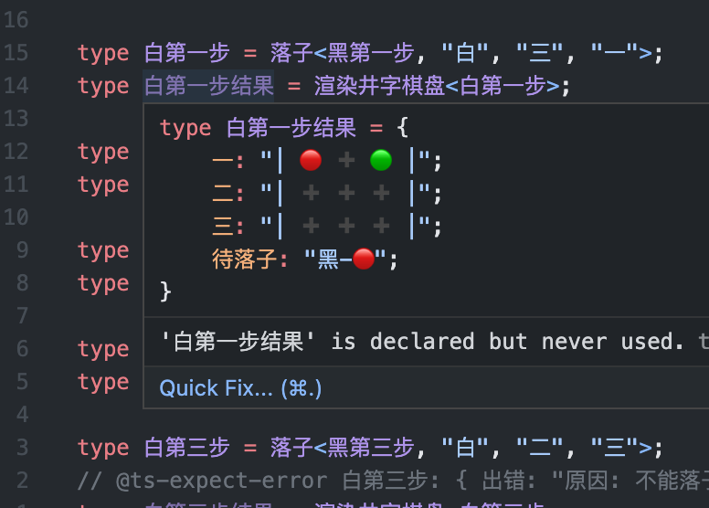

[](https://github.com/CS-Tao/ts-fir/actions/workflows/tsc.yml)

# TS-FIR

> 基于 TS 类型推导实现的五子棋

## 在线体验

<a href="https://www.typescriptlang.org/play?#code/PQKhCgAIUwv9UAQ9DePoaPUomOApgDwA4HsAnAF0mIE9dNJBYOUHvlQX4DIBeSAO0wDdNCBuLPEVIUqkQF5eLSAFc2AE0wAzAJYdZ-HARJlK1QPRmk4oSmZ1grSOqAyFUkKAhgBsAzifDhQEaJEAupoAdTQB9ugM6KgCFugFnagJJyaBgaQtqigG9pkgDeUJC6cYDoKgBcqfwAvvwCmsI6kIAFSoAAcgA8ACqQOMSYco7ePgB8SSmAskrlgFRyPtnV-JCpGdmWeQXR5iWAxtY+SZDdfdm+vCNZkNb5rlPFor6SCQA+kHOTZnvUgPOKVYAL5n112A1NLe2s9-P1jbLNFZUqCh4i16bRSAH5gX0Utl6AxzkVYtRypI-nFWqYERZIIAYuRRVXK6MKMSxgEg5PGVbGE3aIyCAbbVySSqRcaYAUuXJtKZmJKgFtFcksznEkqAYDlydyBdNRIBrRXJQvFl0ggF05cmSwluMBoSCAeQVAPF6gBXrQDB8YAF+MA6d6RIkS6h+QCS3pUUoAabxBj2ePxaABp7diHl8Xr5wG9IA6vU9vs04uCA57PsGXmHhsMIboUsMxtCI0HnaHw5ZU9bKjdKoG2q7IPm7ZHWqrqViaLnC06Q2601GM69JLn7SD3cMy1D2t6XYn45tU7p4YLRIByTUAcXK27uO-vNXxdpv1n0+P2SOsLyCxyAQ7PJlfb3cJ1PTvNVQutYul8uV5lYwDwOjOO+mG0uPW+1xvWFvoy6TyPf9MzjPdh1A7JB0gbIe2bBtAIPaDIGfC8CxBa8S0vO8xwtSBpytF85y-F0P27SNVxI9d-X0bda07Jt2gTJDz0LYtYPvLlRGfAjZwDedgLdT84O-aiKOaOi+jY8swP0bIUNYhicPlQAwHUAEjkel8QA5uUfQAGJQnQAk421SofEAEb9-VMsTIAAbRSAEgV8ABGZc7MIFoACZwAAXXDRzLN9UCIV8Ny-PXUChxogTz0c4sgtaJMwohKygpinwHO8sK42yJLUpStz0rCmFGHiwqGFTWElJpHxAHVtQA6VMAHgVAE-tDphjibI4iGSBymycoOuxbJsQ6klshJDraWyWkOpZbIWQ67lsm5DqhWyIUOslbJJQ6hVsgVCYdgfWYfHqprWAAeQAWyUYhjNqxriwAIjiO6OPHahACY7QBl82q67LLmN4UgAa0wch8AUSBqqOyyXLBqqqsAMm9ACY5eKIWquH4cswHgdB8HGviodqss7GGqslGEfyjLkZhhHccy2gioykritpuFXDVDwYEAaYtAAVtQBZeUAO38zSrEoucAKitAAV1QBwC0kZETlxE4yROekTjZE5eROEUTmlE4dvNeUucAVr8JalyAZeNyB5bpU3lcgVXIHVyBNcVCqsUAAHNHzFyXWB6nWaVdg2Pc6p2hc5w3WGSYZheyEWJY6vXI85v3du9rFABDzQACBK5iXKnd4s-f9d3LKj8Xwz9gv44lpHIDDjLIAjmvo+p4ZY8gBPqdyRnYTKxhA9EPxABgVPnKj5pzID5tz-SH0vy6HUfJ6LgLIFzIerLu4W7s84tR+X1fPPaAAyBebSXu69bXjfebc5eT539u6aQ8q9s46hADPdQBuhO5wfefH3nZ-Dc8+a30+O496QDThncWqF-4rzXhhSBV84qHnvknEogBn5Tfh-YszsJz523IXL+P8hwoUgdvDBWCJbANAcHcBfwiHQLPpfaBndmZINEIAKDk0F8zwTgyhv8ZywMAWiSA+8KGZxoevTCH96E73gXfLuD8XqQEANBy7DeYkJLlw3Okg+b4LAoQ3mkjVFkMESA9OlCJFQLEdQvRx9oHSJKt3aggBMVMAPfRvFAD5yoAA7VLKOEMCoAA5suQAZ9GAFGDSyMh-psHwAAdzYJIMQP5IDBMsnEocVdQKAC-FBx2QAAGHjsgABJEgeNyFkjqww26HlSXGDJ2TcmQAKUUkp1NgnZGCaUyA2w5G4UAIt5gAnINhoAd+VJB3UALwbgAWXbuhieRgBfNz6YM1gIzABH+xM5h1AxADKGYAVPJlmC1EIAYUV1nzOGYAJp3lkrMgL0oZXTtn7VEDMoZUzTk7OoIAHIyemSAuScGZ9jIBcxqJZV5-oq4DIGJZC5EJenrOyDMgZicnk-MABtugAeC2apAQAoYqAE7tOOlQAWmzEB1Fh5REWRyRbijqCjCXEuRScPF4AOlwtAUiwAQ8rzFDikDFlLl4YrXrCm51AGWIt4rUbc-LmXLgAAoFyRcvAliLT4pAANKSsRcvclsrvKArZZiyA1ROXou5SkGV2QxVkopZAeVPLH6QE0hi-lgqlW6rlcMCVOCpV3RlY6s19q7qqrXvEqu7LtX4tNcalIqrsjmtpd8wAm37syRYAb9tSiqr+S6xFxZnUCVjcq71hLoEooDTqu6XLPJBqJdq6VObi2huDRa+RsbAAyEXmrVmag11uJQ26lJrW0IvbeIGtuEGV1uZY27IIqfB9vlAOu1wr07wsHT4cVkq63lrrR6xVLql1uvKCu9Vw6y2Fr1ZW4YBKu0huGOSrtEa6W8sgDG2dCbz3JozbOtNi6VVbtzay4Y+aHWHsgMegYy79Vnq3Ua8dNJrXosnSkIVT6N1FoXeuwD68FWvuzduv1mqBgttA1Wi9YGsSxt3fWjqgBQ-UALwhrzsivI6oAZb9AA55tkCQJxqMpEAP7ygAKV0ADPKgBEFUAH8pgALCMgqbcYkbOkTpnUOz9aKm2zvwyUBlU6BIMtFSkdNLZXnLjXQJJjkANMpAALKWX0CcbMGqv1aoLUW0jFGek4eGPR8NHUOM8YE9kfTid3AakABTqAnAC0coAduDABryoAcGMQh1v6UELdAtr2AE4LQAdsYCaC7G0LdbeJ1oE4u3Fy5wulxLicMM-p0v8cXeGCKLZczhYwY+XOFciuM3i4lwLyWwuVCK2+7dN4qjhYrIw75SX4Upd4rcQjLrsuDPUeXf0DX+P9cG8N+FP7izde+fF2NGLZstZSPNjFkrFspByxNouU2EszaawNlr230VLf6aqTzngfP8YCyFkIgB0JQi70QAqsq7MRdFy103+u3DrUEULX2BUpC+xllNWWUhvdLvnfL8SIfFZTaVyyuY3tVfdtIocSP6snYB0DkH33KhI7fWqzrlQ3s9YQbIs5QXAfA5CKDobDb13Llh1w928T-tnYZ0TgVgPFuQCpwUO7MAgug4xb9+R9OehfYxZUW4X2lX+iV7sn9ov1SeAB3zIIXNpe4R17zIIX2hsjafcuW4WiuGTckBt1L83ixW6sXAyGbBASuUB+GQHJX5708J0z4ngOneiOxzI0qNOmFwtW-C9bvPdem622t9Fu390eudz-Y7yf7eK+TyHl3ubtxQy90OH366K7+8Z8z4PkBncAOvhBJmvWxM0kAP9mgAjY1jYDs38LJVjdnvolIgAG01Z7B5cmC1EZrLuLZcgBb+MAMdygBCa2EpRSQvtbesAX8vt3HvICAEILQAMVmADgVIIC-QpgUPyfs-A-rFkx0VOHiW-52QAn4Y7cUE-dnbm7G4sl-T-z7aB3yBEAGV9ToOtBuMCUA0fFsetCAocXMJ-a7PsASD-auIcKDNAtAxIaTbIEfH9dpZcTAsKKApDQgoguMEgtDX1cguMMPNAkdGdVLOA6ubAgNSgotAg5gjKSg49D1Gg4YDvLvJg-gsKR3Lg6uSrcQjKEfMgkQ1-GfKQsKP4P-M-Og8gtQtAjQmmDuegpvemPQ7Q2+OxFvLEQQ2dW4MHYYMvMfGHcbKfCWevS3LmUubFHpa8FITBbBKfbOFIJ-EKNfN2DfSAPwovd3IEFQgA8MCIlfZoMBevCubiGcRAl-UhcWZAlsVAocSvfnRXOtX-Y-f-QA0I3fUAn7NAiEUopVZgiEBApfZ-KnIzcQiECDW1YbTmYsUo8tcnSATo7NNVLQxvFomdSwkQnozoLNeDRQ4YXo91ZDUYyAMwutCw3ieY4PKYuMDHdYqwrmWQ-gzwiWXYmg5Qgo1Q9YgYsKc4hmXQnQgqAwyPZvM5D6MQEYyfGA6fZcLwt4nw4YXZQ2G3I7SQYRcBbOZuN-ASX4yWCEfZQZRjGFEwkoD6EYiwpVZcV4hsfWA4lIT49Ezmb4yACEzPSQCw-A4ooEEjD6fXIcck96ZwrhVwsPCEak2kqfSoXpNQiEX5Nk5eAZag2435GZVobk-pXkw8JkzmJJCuJ4gVEEv2YsCEsPK48Pb5QAH6NABS42Z18Pn3oy8R8TYH8RSFAO1O3G8UID8XiQXyNIEjujukgM6G1OyQKQtLo1yDqUSENOdMaUePejrQVy22RSh2pWXAJP+NRL+Kn1lM1MtJbBNL8SGTujn3nzsJbAOFYFdi51V39IEihlKPDAXyTIbChi53nkqJR3Jjrklk5ynmrghA+h9PRRWMwN6J9TmPIIhMOLCgjJoLVOZydOLERMqFKJzgOPLLlLIXcKOKqDzPOK0OyCdOpmyBLO02pghDnP0JuPuMjz60AHT9TBYQhFHbF1PbYYPM-wz2eJZPdrNeX3MCfzHcicVLC8qgixScxM6nJCPM7czBF7XietA8p9H9I84IxM08zqc82dDFMnK80sm8u878389FSC58yoKc2xIC-pAoLEfzQAHYDABO024yGWFhXVNmPm4xtJODuhmEABzTMiyAO6QAWeVqKMKSh4s8KgtyVM4DTOgwy3jMThg8LLJsK8L4l+LtwV4V1wwgTKg-hQCHDzEMIZLxZJFUKRKrS9ZSKJKTFM4FLHCygqhtLb83zsgVKWwKLqKNKwEpK9KuLFK5LixpLrKlLlL8LRKGK7pzLTF8x9Lt4MJ7LZK4FULEEsRbhuNdBLAsLABKJV4mMobEEu4ycNjxT0PLTxbNuG4pxMNkDKTxJQDPEEt1eX+R6WXAisAAEjQAAHTiJmhzYWQEzt9tw5gpZ4l5tMyYCkVvc0qXgwEK4mqSSWTbgAVlzUg0cbRkiSryrQRyjUgIDsgWLuM2LyhM5UqZ9IA8L0iCywjXJ2K55qza8QqwrIrxC8L2zQJLsjq4xNrZ4wJzrGNTrgN2qXROqRCIQY848u8E9dlc8ErixNrzjG8xAbra89MaDRrJJxC-gn9pypq7iaZEJDxEIxgmLRBQqIqhtoqXhYr4q-yWrALFrZ54rmr0SkU8q3ltxAbIBgaYizZLZGrUaXRYrvddrkbbhDra889a9hymqncNMybwqyq+gAradMKtzyaPrMaCaf1-Rbyvye8ILkqNxSTXIvzwwvyfpz8hxlbtwFQBqWR5yUiXtLISQBqDb9DnFKgslAAgsxoEAHpTQAQGNAAYBgKQ+i+i-NaFyEAFgGF7PXeFLJBUgw4w8ALEQAQujjRQd6NpbEr-zkrLc7rYjKE8aUStt8qSael4lbzhbLtVqXgoZybwxyb9aqb54kbIr0aWbPq2alqOaAbCrubebxrDCI8lTXBBbyUegOLpjrLcbOL61F1lxQDM0qj-Re7XVmyqj0DNKqErLZLvKOiHKDLUxB6N1z0oLYN3KtKZ7iFdKByZ7-LUwaV-aSgg7Q6srRaOqFtI7OLo6flKFASx7Kg0zhz180juc4ts8v9NttjPrz6bKr45asz1qxjYChx57ryhwechCq9icID57ALuC16RTaCgDXJB6yiEp-7sqn1kGyykGeq3j-g-6+q3DqjK6CqmjIAg6Q66MGyaCTr1iFL-rQIkG6G4x8HFCM6XRszOhyHFCmJtxQDOH5iIRmH5jshbzm7W75iKDrLGGYH60pHiDOhM0tjIBWHmgoZRGtrHrFFegL6HrxGIQD6KGTrNGW7H7xHw91jFSaCLHMCrG1zb59CkGJSJrklq4bGzHG8bi-a4VAA87UAF7TMjTmHvPvLbbR2OhO4mgSUm3c3LXi3WuHIIo3E3d6x3Mu5RyAdh5Bio8YkeuMTJiYg9RxlBnPZJxapShBsY8AiaqA4B7asw7vRQsQkQkp2-RhoY+tSh8gxY5YqAp3SewBX5fBjCZ22Rng99FskQygxeu-Ig8cvY+88Q1J4vZPEhy7VPItLh4xWNdpmgypeYgNS7NpEQ3IWR9+5ecjV5Jekyq5MCO6B5JCO6K5Y5ku5eZzPjfjC5hsfQPR40UO9OpCP6xR+bZ5rjV5uBmgn6uu8Q1x9xux249cmmE2rJUAvme2xIR2qqRXXpneI510tFrZphvy0F2gt2wAJ91ABIcy5hRd6I4LpP6qINyYAruh5KmduOtLdu9pvnrs8evX8cCdGzCYKo+IllRnRiBhBlOEOluhSD9mFe3AxjFbmCOniUkpSAVcaisndlRhbNVaJmldJh-pbGLyrIEZCarNL1jWXno3eZeGcfnnwcskBbujOZ6UJayLvId3NeSoWb-t3MIaicOxIclonG-IdaLXFrKcVo0b9fDNNf4IhHVu8JjY0esG3HPCaavhITrXBYmuTcihnCafXudsUfnl8Z5eKfZq5t3JIReyzescgARfdhRY1YRjdsAFDYtJTBOqFF3F52tlmt42lxLJP2FF3V+GVt9ticTth2z6dF3cl2129l0xqF2tuFogpd6F+u64mFxvBFwAFL1ABT6MAEZXFFh1p1teXIAAWgKRPZsytZdF6RIYhX6UhcgGhX6Tdv8YXduIRZoAYH8cABh-49j1y1zyC9q9oDujW95oe9ul85WZZgqFWZEl7Cz9jchus5QAXCVABpzUzUk0rkw17VE1Zg1AAAF5BcBCBMAABjWwBoWQSAdFQAZDNAA++J0kACQEwAJX1l9AAFNMADYlA3eUDjtORFAJg1QlJVaHYYeN5MqiSQVppFSoLDnDnwIXGVYsMQL1ko8Y8MRclqjBsCW9RFe9QlPFwciA5EbcZWiECQbIQT1OYTze1NcRZ2tQn2jxpmTXNmSAUjzAcjqjmjzAOjxjljjj7jvj6AKIa9Wz0LNp0T6Agmntf5yT+8kKcfINkKeJOT1LWz+zv63WjCY9NTjTkAsA7TsA6piEW9OtIzvcmBvIszyyH1mDm1lxyAKLkINp7ppz+8wZoNlzjlh4sXLzsjij6j2j+j5jtjzjnwXj-jmkNOaL+FW++8vW7cXwf0BTFISpANNrtp3L3cl7YsRkDqI5lIe5+MlIRLg+JbutA7s2OKVUPe0QFkTmdmAk5gFIE4SSkkQ76RT7m+7722X7jZ0xaqyAfkD74HzOIUH7iHyS6HwHhGvlVOZ79metXDmyYYUdZcLHlIHHzH4YlTfHpT7Hgn+dXH0nkn4n8npTryRH4xFHmL4YGDFsNOBn2dQnyANTeLy8ndVgZnhsDHtJv+h0fGl4PHoX3fMsUXl0cXqGO0EkaX5oWX4X2kRXjZplMn4YOXlkNX5XyX7kXXin2yYXoUQ3qnrX4XyUM3jX5yYXhUa3xFZlLycy2ddpnZuMANW1ZgkX06y7tAr3mgqX-6v3zAgP-g+X1NRQkPogsPkQu0VX2R6P8g2P0Yu0HXx5pPmglP+Yu0A3x54YTP-g7P8Ru0U3-PuMQvkQ21O0K3tT4sav+3uv8QN80xvt2gs4lh+Z5grQwkDKE7jKJPsVeKfmphFOZHl72NdH8ntnudEnmfjn1nif9nzX+npf2f6ftfhf8f1H5fufzflfxfnf9f-H+f9cStR7pHtnx9Fn7fyfwAvnyyQXuXrdSyQ-tHlfuX7EOLsX2-3f43yXkkN-xl6-9j+EvIEPHyAFK8QBHPbXpANX5H8YBwvbkHALf5-8LekvIUCgOgEf9LeWA0-rb0l4Kg8B+-Z3qPU2bUx3e5mBgjPzxZzg6uMfEAbQLjBlh6ByfRgYoXl6sCs+7AnPrSC4FF8eBJfFkPwKr6CDTGufEQaMVQE1dTGAYTAeXxP5r8CwkoPIvALaZ2giBhXNvqBG0FKMO+IhcFhDU0IHNOCGUM7rsST4w09Bm5eEqIA+go9Fu82SVGZmsgYwhe8UciuUDcqgRyK2IbwXGHIokh-BwwcirSGCHEUWQ4Q8ityCiG0UhQsQu6JKASEKg142QNwfLUgAVMcmmQyyG6nCFDgbSgAXuJihJQ0oWUPKGlDaKOtOAd6nyHXNIAgALuImhzQloa0LaEtCqh+hOAXK1BjasBqRTH-OKyOhWQ60O8MpiXm2rWEWqWQialkkABVxDi29IK5BckdMHi9zbJDC1Wowl2pADmFZJ4OUNddjrThbGEOkWIRTsv0kCC8LhjvFfjcI573C7h2HG3ikEeHLg3hrw54bcPeFfCHhvws-nTwuFT9hgFw0AaCL+Hv8fhkIz4dCJBHPCwR8IiEWgMgDgiARtg6gFhwcHX0r+QItoAUAv7GJAAqXJVQj+vELnifQ3S8EWyWmaYTzyVbDEFO-wpvupzKYi9wwIvbJmQPk5vC+IjnFkRkKl4DUpenIlBrah5FB9m+rIhXoQwj4iiJqlAzAgGgM5GcRiOfQlI82VGJpjOEozUUmgj5aCziJgogv+k55GjMC56RzIoXKTkE12bjFriuztGoc-aY-YkYRlYBpxXRu3QrqyKixDgHQcAgBtkI9Ekj1BW6b0QKK-5Civ+1TeeMGNJEsDwxv9AATMO2qcCYx21DbvMQVFEElR9aarkwKIL+jy+lXfMQmJvR5itRqWTgQaNb5mi0C-fUYuYPWKV9q4mRTAuC1tFLtXGVjRUs6JKDkZxS8yAccskwpYUhk2FR5Neg+iujHB5uFqi4KshuCVAHg2il4JXF3Q-B64oISuIAAUDrYDkkjAgDikI2FAAJSeQ0hQMMpimIhBwCBxA1LJGB1PqnsQOl7RINe3OaeRQUydGDo+wOGvtik1QgSlhQfFPiLWEHV8WBLugHjtwYKWDpChfaId9hXQkVpjE2ENR+hr9d1vCmLDasRhYwjIRMLLJTD4uhDeYYsLrK5EhcsIXCRKyJjbCXSewg4Q6NQ5HD12cmUQFhxnHX0ZxouYAGsPZgEiUeWHbUqwHsEvdFumIiSaqCxAo8ukDoQAKbWkgHllJMGHmDaKfg+6EEMJCySXu8k8oApNEmQBxJmzOSYpJkklAUeUyRScpICZmSDJ90B5FpPjK0VtJ-AXSezGskGSjJJkxblZPMl08zJ2IJSawB5b+SHJtFB5q5Jcl3QwhOkyyXpLLCGS6MkgXyZUCCkKTbs-E10QSJEkpSxJ70GcYyJnEWTRA+kkKZABUmYcZx90KKXdC8H3QvB8UsqYpJ8mFSSRi3cqaVOoBeSKpPLcqY5JilBDGpT0dySUF6ltSipvU7qeciSm2TKgvU2qTFM0kaTRpBI+ScFMmkdTWSSUmadZOCnzSNpCkwac5Puh+DmpPUpKVtM2b7TMpdPeSSSD6kBNbpS006dFIumzTHp10zqfLzuluB+JzAdoMkGAD8ThgXUWigsLGSQANkkAYZAsl2HLIQZcYPqBDOhmwzRksM+GXMMRmgyzY2QO6AsJhkwyoZ2M-gEjOGDYV8ZXSc9mMhxntJG6JQQALOJgAWE1-G80xaZFKGkxSmpZM-icR2ICOBz2GgKjsQCFmEBCARASACzP8bZBsC1SWirUiRa8xbaAPcoK7TJYUs4ZrtCZPTKxDSzOY30yoPrJmk-tAA536ABbvzZmhSAmD046bRScmrTnJhIJGfzMFnCzKOosngBLNchmzLZnMWWZAHll3RakP7f9rbWpljJ1ZE4tYG3GrAMALZ-jQ2b7P8boggAA" target="_blank">TypeScript Playground</a>

## 效果

### 落子和渲染

|初始棋盘|黑棋第一步 (二, 三)|
| :---: | :---: |
| ||
|白棋第一步 (三, 三)|黑棋第二步 (三, 四)|
|||

```ts
import { 初始五子棋盘, 渲染五子棋盘, 落子 } from "./src";

type 初始结果 = 渲染五子棋盘<初始五子棋盘>;

type 黑第一步 = 落子<初始五子棋盘, "黑", "二", "三">;
type 黑第一步结果 = 渲染五子棋盘<黑第一步>;

type 白第一步 = 落子<黑第一步, "白", "三", "三">;
type 白第一步结果 = 渲染五子棋盘<白第一步>;

type 黑第二步 = 落子<白第一步, "黑", "三", "四">;
type 黑第二步结果 = 渲染五子棋盘<黑第二步>;
```

### 计算结果

> 「五子棋」计算结果时递归次数会超出 ts 限制，只能计算「井字棋」的结果

|初始棋盘|黑棋第一步 (一, 一)|白棋第一步 (三, 一)|
| :---: | :---: | :---: |
| |||
|黑棋第二步 (二, 二)|白棋第二步 (三, 二)|黑棋第三步 (三, 三)|
||||

```ts
import { 初始井字棋盘, 渲染井字棋盘, 落子 } from "./src";

type 初始结果 = 渲染井字棋盘<初始井字棋盘>;

type 黑第一步 = 落子<初始井字棋盘, "黑", "一", "一">;
type 黑第一步结果 = 渲染井字棋盘<黑第一步>;

type 白第一步 = 落子<黑第一步, "白", "三", "一">;
type 白第一步结果 = 渲染井字棋盘<白第一步>;

type 黑第二步 = 落子<白第一步, "黑", "二", "二">;
type 黑第二步结果 = 渲染井字棋盘<黑第二步>;

type 白第二步 = 落子<黑第二步, "白", "三", "二">;
type 白第二步结果 = 渲染井字棋盘<白第二步>;

type 黑第三步 = 落子<白第二步, "黑", "三", "三">;
type 黑第三步结果 = 渲染井字棋盘<黑第三步>;
// => {
//   一: "⎪ 🔴 ➕ 🟢 ⎪";
//   二: "⎪ ➕ 🔴 🟢 ⎪";
//   三: "⎪ ➕ ➕ 🔴 ⎪";
//   获胜: "黑-🔴";
// }

type 重复落子 = 落子<白第一步, "黑", "三", "一">;
// @ts-expect-error 重复落子: { 出错: "原因: 当前位置「三, 一」已有棋子「🟢」"; }
type 重复落子结果 = 渲染井字棋盘<重复落子>;

type 不能继续落子 = 落子<黑第三步, "白", "二", "三">;
// @ts-expect-error 不能继续落子: { 出错: "原因: 不能落子，「黑-🔴」已获胜"; }
type 不能继续落子结果 = 渲染井字棋盘<不能继续落子>;

```

____

> @Inspired by <a href="https://github.com/chinese-chess-everywhere/type-chess" target="_blank">type-chess</a>
